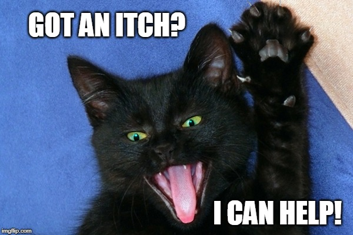
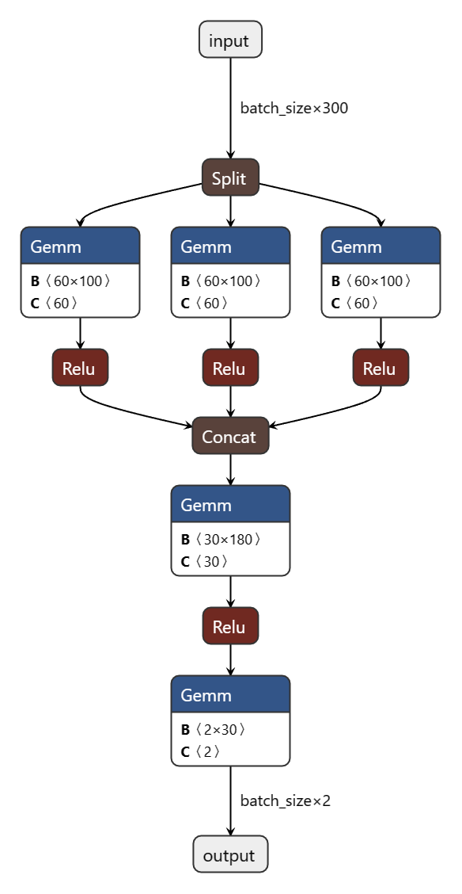
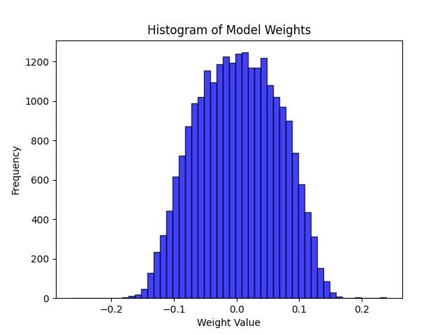

# Scritch

~~Deep learning is essentially part of digital signal processing~~  


### Debugging esp-idf project on WSL 2
First, install usbipd on the host(Windows):   
```pwsh
$ winget install usbipd
```

and the step on WSL:  
```sh
$ sudo apt install linux-tools-generic hwdata
$ sudo update-alternatives --install /usr/local/bin/usbip usbip /usr/lib/linux-tools/*-generic/usbip 20
```

List all the devices on the host:  
```pwsh
$ usbipd list
```

```
Connected:
BUSID  VID:PID    DEVICE                                                        STATE
1-2    1a86:7523  USB-SERIAL CH340 (COM7)                                       Not shared
1-3    0b05:1866  USB Input Device                                              Not shared
2-2    1532:007b  Razer Viper Ultimate                                          Not shared
2-4    8087:0029  Intel(R) Wireless Bluetooth(R)                                Not shared
```

Attach the device to WSL:
```pwsh
$ usbipd wsl attach --busid 1-2
```

Detach the device from WSL:
```pwsh
$ usbipd wsl detach --busid 1-2
```

### Collect data
Check the `COM_PORT` in `sercomm.py` is correctly configured.  
```pwsh
$ python ./collect.py 
```
This program reads all the data transmitted from UART.  

### Modify model & Training 
Open `model.py` and change the parameters.  

```pwsh
$ python ./train.py 
```
The pre-processing steps should be implemented within the ScritchData dataset (in `utils.py`).  

To check the size of the model:  
```pwsh
$ python ./model.py 
```

### Testing model on computer
Make sure that the pre-process procedure is consistent with the training steps.  
```pwsh
$ python ./test.py
```

### Model Structure


### Inference on esp32
Run `export_params.py` to export parameters.
```pwsh
$ python ./export_params.py
```
Then just use [`esp-dsp`](https://github.com/espressif/esp-dsp) to perform all NN operations.

### Quantization
Just make this model small enough to operate on fp32.  
~~Check the weights of the trained model:~~
~~~~

### Converting and run on esp-dl framework
It didn't work.  

~~Then follow the steps from [ESP-DL 用户指南](https://docs.espressif.com/projects/esp-dl/zh_CN/latest/esp32/tutorials/deploying-models-through-tvm.html#)~~

~~[==](https://esp32.com/viewtopic.php?p=111753)~~

### To-dos
- [ ] Train model
~~- [ ] Converting to tflite model~~(I skipped this)
- [x] Deploy model to esp32
- [ ] Add BLE connectivity to esp32

To be continued...  
