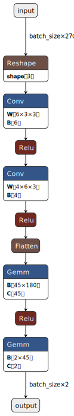
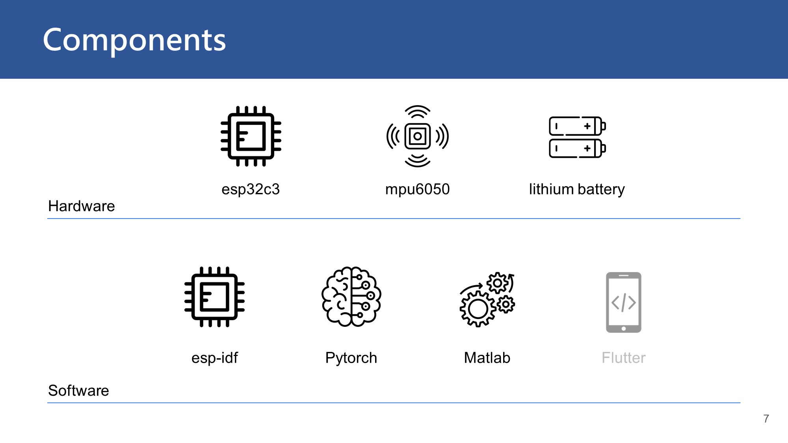
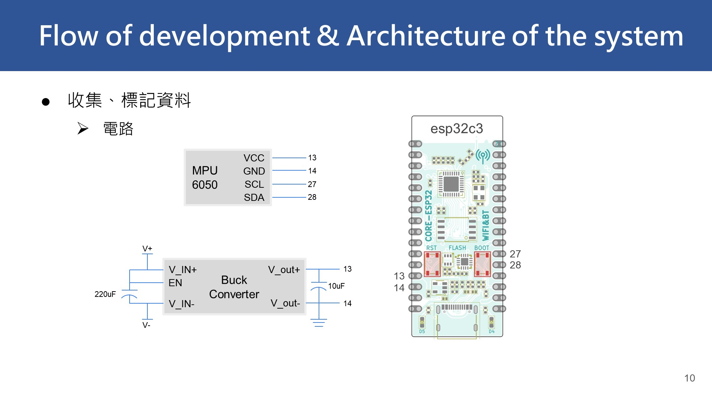
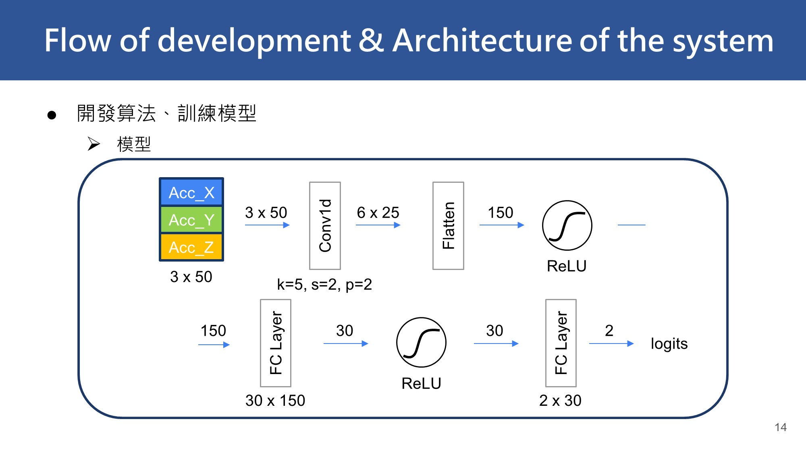
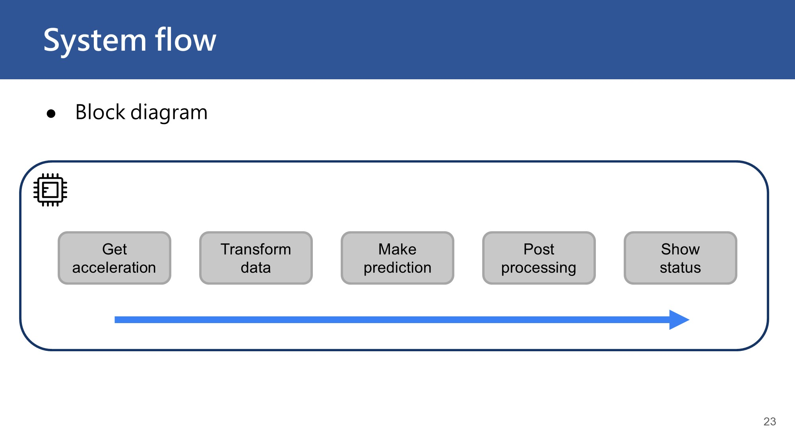
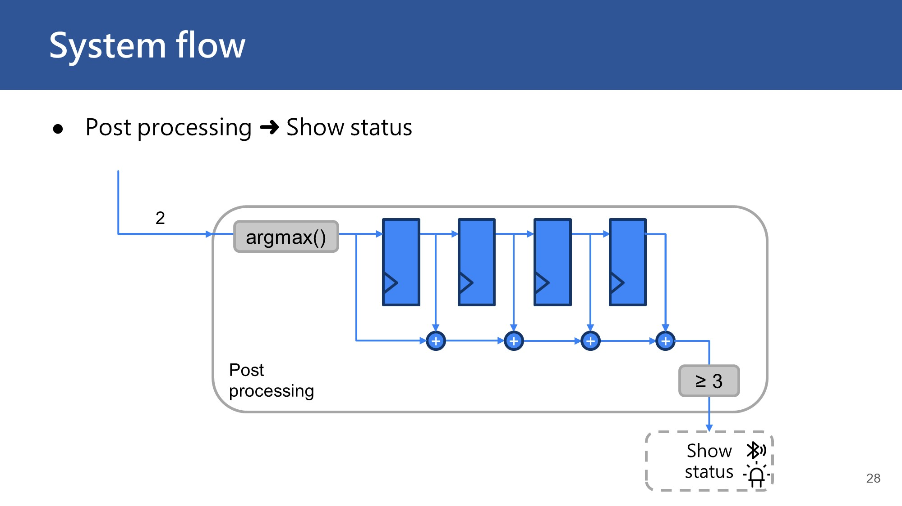
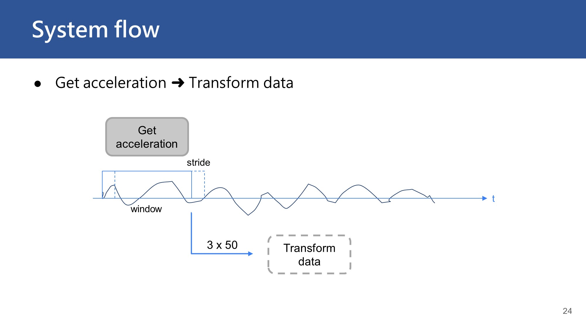
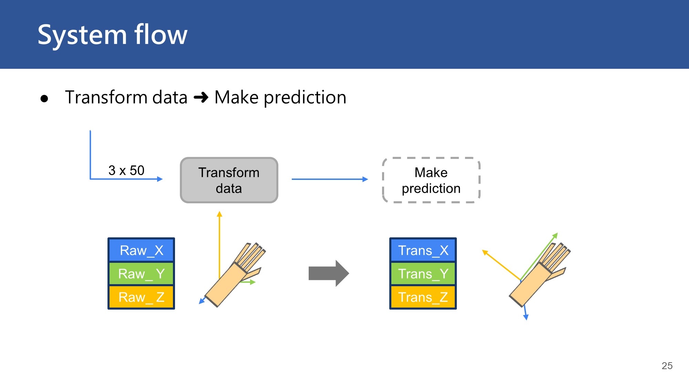
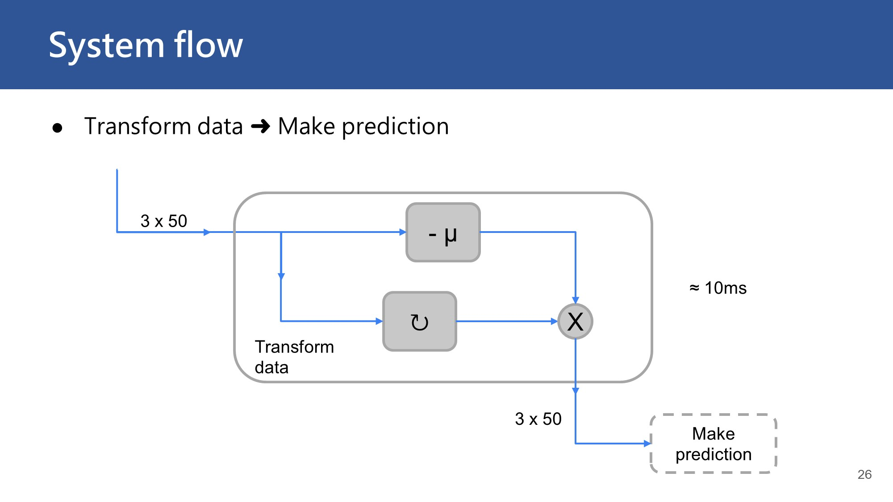
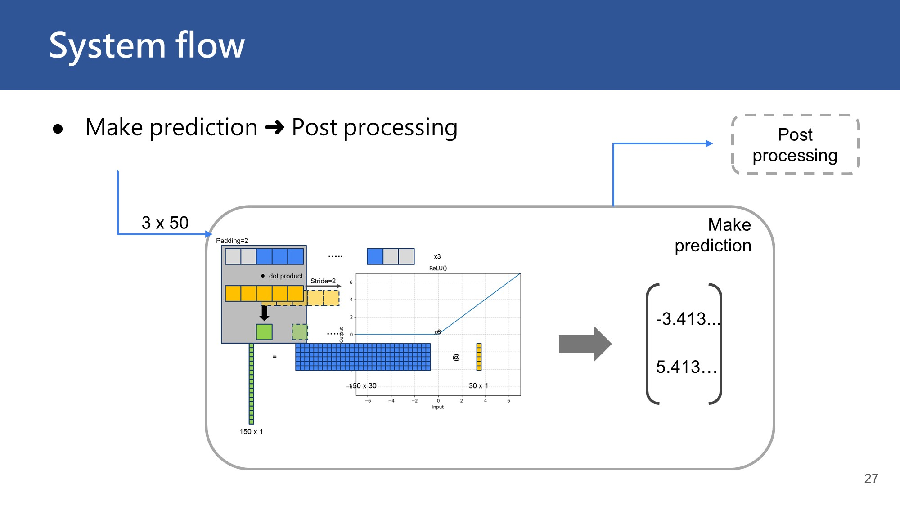

# Scritch

<!-- | Department  | @NYCU EE                             |
|-------------|--------------------------------------|
| Course Name | Digital Signal Processing Laboratory |
| Professor   | 鄭耿璽、桑梓賢                          |
| Semester    | Spring, 2023                         |

~~Deep learning is essentially part of digital signal processing~~  
 -->

<!-- ### Debugging esp-idf project on WSL 2
First, install usbipd on the host(Windows):   
```pwsh
$ winget install usbipd
```

and the step on WSL:  
```sh
$ sudo apt install linux-tools-generic hwdata
$ sudo update-alternatives --install /usr/local/bin/usbip usbip /usr/lib/linux-tools/*-generic/usbip 20
```

List all the devices on the host:  
```pwsh
$ usbipd list
```

```
Connected:
BUSID  VID:PID    DEVICE                                                        STATE
1-2    1a86:7523  USB-SERIAL CH340 (COM7)                                       Not shared
1-3    0b05:1866  USB Input Device                                              Not shared
2-2    1532:007b  Razer Viper Ultimate                                          Not shared
2-4    8087:0029  Intel(R) Wireless Bluetooth(R)                                Not shared
```

Attach the device to WSL:
```pwsh
$ usbipd wsl attach --busid 1-2
```

Detach the device from WSL:
```pwsh
$ usbipd wsl detach --busid 1-2
```

### Collect data
Check the `COM_PORT` in `sercomm.py` is correctly configured.  
```pwsh
$ python ./collect.py 
```
This program reads all the data transmitted from UART.  

### Modify model & Training 
Open `model.py` and change the parameters.  

```pwsh
$ python ./train.py 
```
The pre-processing steps should be implemented within the ScritchData dataset (in `utils.py`).  

To check the size of the model:  
```pwsh
$ python ./model.py 
```

### Test model on computer
Make sure that the pre-process procedure is consistent with the training steps.  
```pwsh
$ python ./test.py
```

### Model Structure
  
MACs: 13860, Params: 8373 @WINDOW_LENGTH = 90

### Inference on esp32
Run `export_params.py` to export parameters.
```pwsh
$ python ./export_params.py
```
Then just use [`esp-dsp library`](https://github.com/espressif/esp-dsp) to perform all NN operations.

### Quantization
Just make this model small enough to operate on fp32.  
~~Check the weights of the trained model:~~

### Converting and run on esp-dl framework
It didn't work.  

~~Then follow the steps from [ESP-DL 用户指南](https://docs.espressif.com/projects/esp-dl/zh_CN/latest/esp32/tutorials/deploying-models-through-tvm.html#)~~

~~[==](https://esp32.com/viewtopic.php?p=111753)~~ -->

### Components used


### Architecture



### Model structure

```
----------------------------------------------------------------
        Layer (type)               Output Shape         Param #
================================================================
            Conv1d-1                [-1, 6, 25]              96
              ReLU-2                [-1, 6, 25]               0
           Dropout-3                  [-1, 150]               0
            Linear-4                   [-1, 30]           4,530
              ReLU-5                   [-1, 30]               0
            Linear-6                    [-1, 2]              62
================================================================
Total params: 4,688
Trainable params: 4,688
Non-trainable params: 0
----------------------------------------------------------------
Input size (MB): 0.00
Forward/backward pass size (MB): 0.00
Params size (MB): 0.02
Estimated Total Size (MB): 0.02
----------------------------------------------------------------
```

### System flow








### To-dos
- [x] Add BLE connectivity to esp32
- [x] Use nimble instead
- [x] Train model  
- [x] Deploy model onto esp32
- [x] Apply DSP algs to make the prediction more stable
<!-- - [ ] Detecting which part of the body is being scratched
- [ ] Collect more data
- [ ] Motion detection
- [ ] Android App

To be continued...   -->
